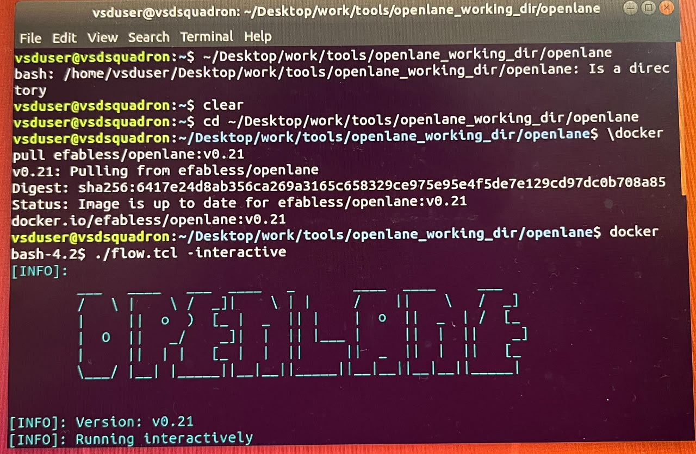
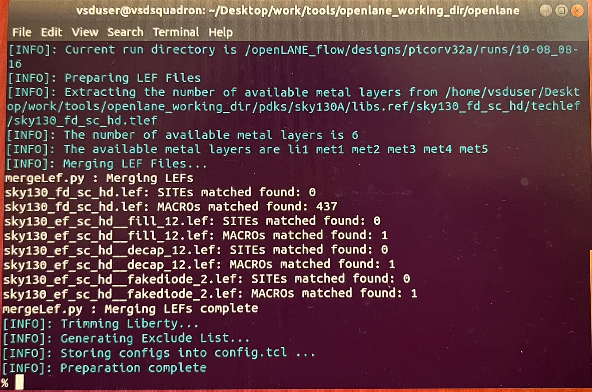

# Day 2: Design Prep

## Design

- Design name: picorv32a
- Source: OpenLane example designs
- Technology node: SKY130 (130nm)

## Steps Performed

### 1. Pull OpenLane Docker Image

```
docker pull efabless/openlane:v0.21
```

Image was already present and up to date (v0.21).

### 2. Launch OpenLane in Interactive Mode

From the OpenLane working directory:

```
docker
./flow.tcl -interactive
```

Output confirmed:
- OpenLane version: v0.21
- Running interactively



### 3. Start Design Prep Run

- Run initiated for the `picorv32a` design
- Run directory created: `/openLANE_flow/designs/picorv32a/runs/10-08_08-16`

### 4. LEF File Preparation

- OpenLane read the number of available metal layers from the SKY130 techlef:
  `/pdks/sky130A/libs.ref/sky130_fd_sc_hd/techlef/sky130_fd_sc_hd.tlef`
- Metal layers found: **6** — `li1, met1, met2, met3, met4, met5`

### 5. Merging LEF Files

`mergeLef.py` merged the standard-cell and auxiliary LEF files:

| LEF File | SITEs Matched | MACROs Matched |
|---|---|---|
| sky130_fd_sc_hd.lef | 0 | 437 |
| sky130_ef_sc_hd__fill_12.lef | 0 | 1 |
| sky130_ef_sc_hd__decap_12.lef | 0 | 1 |
| sky130_ef_sc_hd__fakediode_2.lef | 0 | 1 |

Merged LEF generation completed successfully.

### 6. Liberty File Trimming

- Liberty (.lib) file trimmed
- Exclude list generated

### 7. Config Generation

- Final configuration stored to `config.tcl`

### 8. Result

```
[INFO]: Preparation complete
```

Design prep stage completed with no errors.

