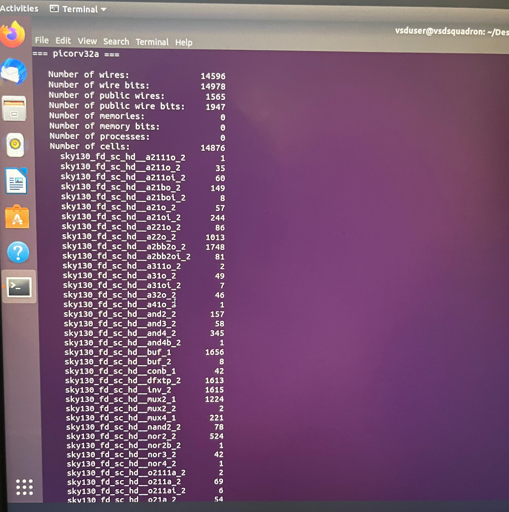
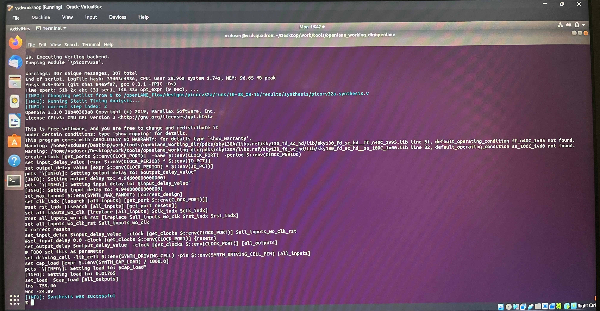

# Day 3: Synthesis (run_synthesis)

## Design

- Design name: picorv32a
- Tool: Yosys (synthesis), OpenSTA (post-synthesis timing check)

## Steps Performed

### 1. Run Synthesis

Executed `run_synthesis` inside the OpenLane interactive flow. Yosys mapped the RTL to the SKY130 standard cell library (`sky130_fd_sc_hd`).



### 2. Synthesis Statistics

```
=== picorv32a ===

Number of wires:               14596
Number of wire bits:           14978
Number of public wires:         1565
Number of public wire bits:     1947
Number of memories:                0
Number of memory bits:             0
Number of processes:               0
Number of cells:               14876
```

Key cell counts from the mapped netlist:

| Cell Type | Count | Notes |
|---|---|---|
| sky130_fd_sc_hd__dfxtp_2 | 1613 | D flip-flops |
| sky130_fd_sc_hd__buf_1 / buf_2 | 1664 | Buffers |
| sky130_fd_sc_hd__inv_2 | 1615 | Inverters |
| sky130_fd_sc_hd__mux2_1 | 1224 | 2:1 muxes |
| sky130_fd_sc_hd__a2bb2o_2 | 1748 | AOI/complex gate |
| sky130_fd_sc_hd__a22o_2 | 1013 | AND-OR gate |
| **Total cells** | **14876** | |

### 3. Flop Ratio

```
Flop Ratio = Number of D Flip-Flops / Total Number of Cells
           = 1613 / 14876
           ≈ 0.1084  (10.84%)
```

### 4. Post-Synthesis Static Timing Analysis (STA)

`run_synthesis` automatically triggers OpenSTA to check timing on the synthesized netlist.



- Netlist written to: `results/synthesis/picorv32a.synthesis.v`
- OpenSTA version: 2.3.0
- Two default operating conditions (`ff_n40C_1v95`, `ss_100C_1v60`) not found in the liberty files — flagged as warnings, not blocking
- Clock created on `CLOCK_PORT`; input/output delay set to 4.946 ns; output load set to 0.01765 (from `SYNTH_CAP_LOAD`)

**Timing summary (pre-optimization, first-pass synthesis):**

| Metric | Value |
|---|---|
| TNS (Total Negative Slack) | -759.46 |
| WNS (Worst Negative Slack) | -24.89 |

Negative slack at this stage is expected — this is the baseline synthesis netlist before any timing-driven optimization in later PD stages (placement, CTS).

### 5. Result

```
[INFO]: Synthesis was successful
```

Synthesis completed with 307 unique warning messages (no errors); netlist ready for floorplanning.
