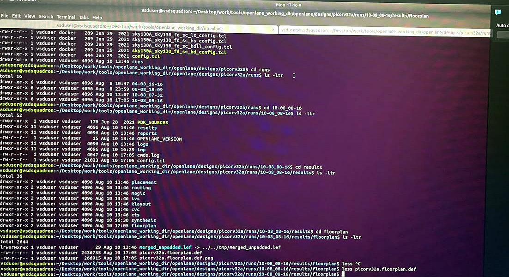
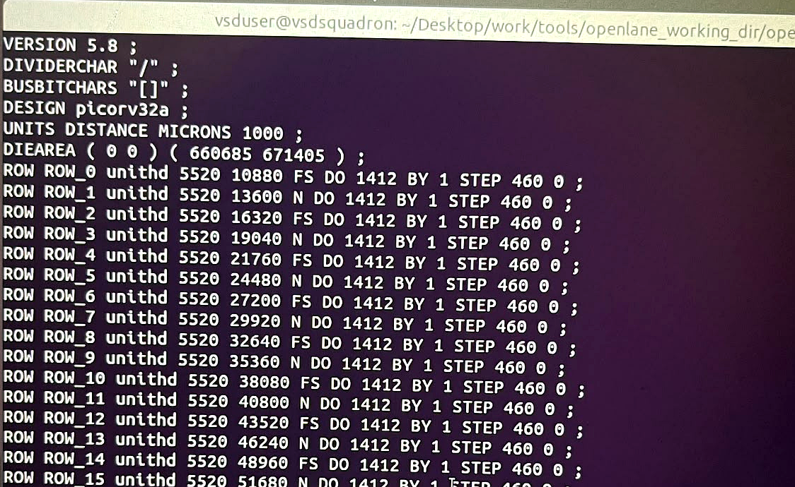
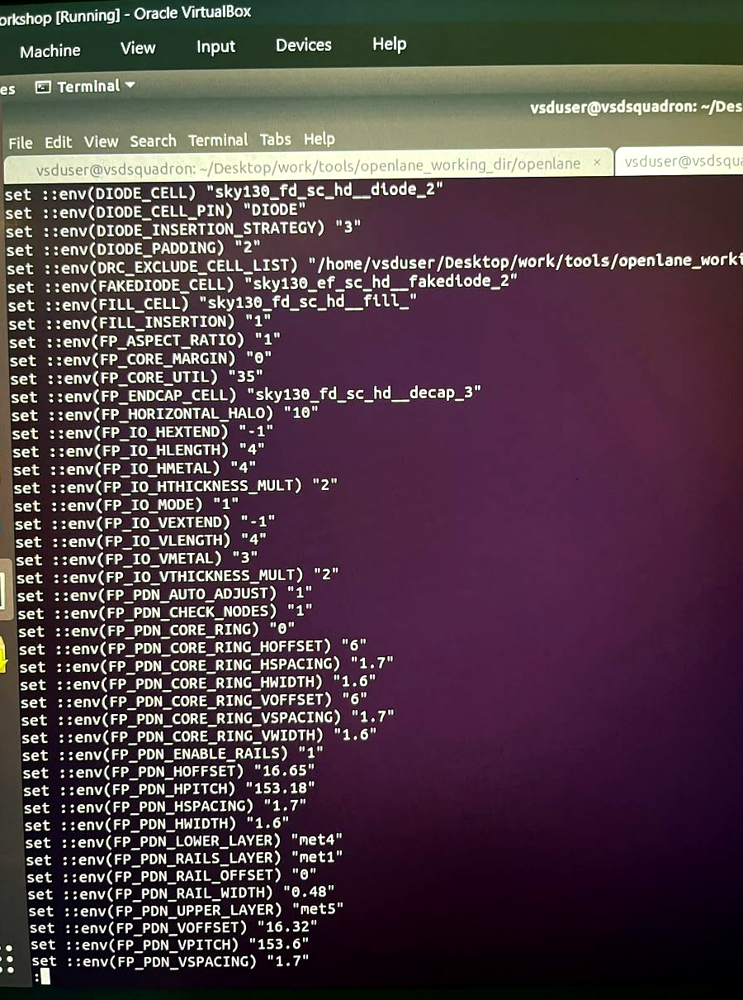
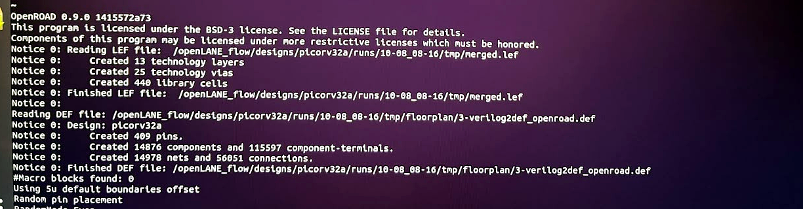
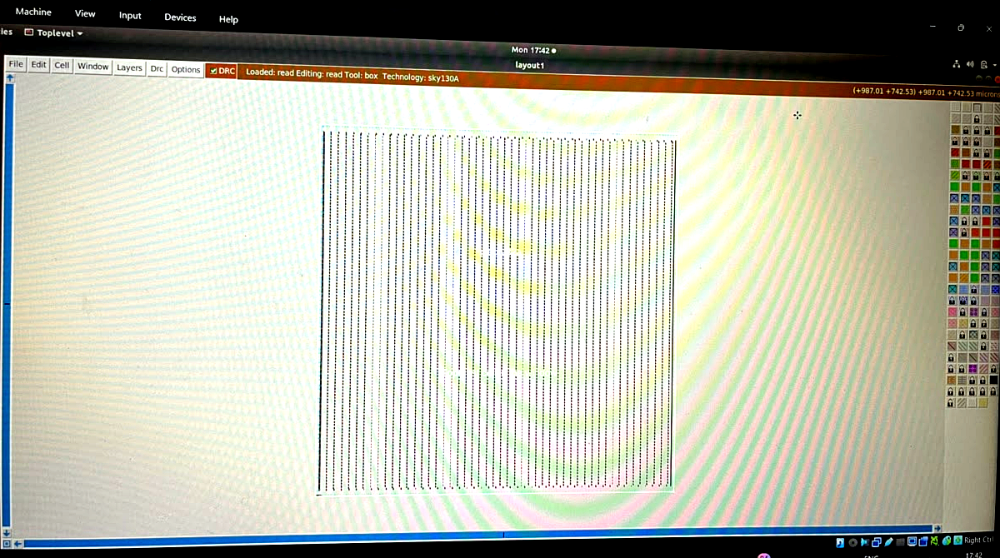
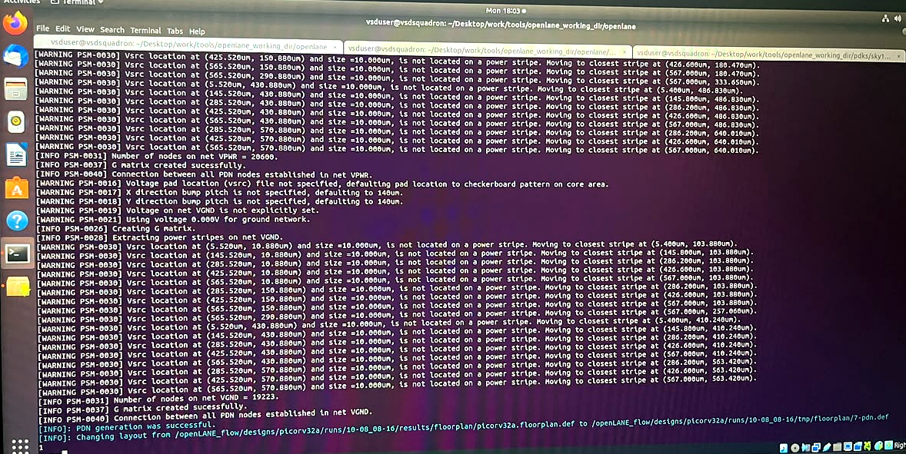
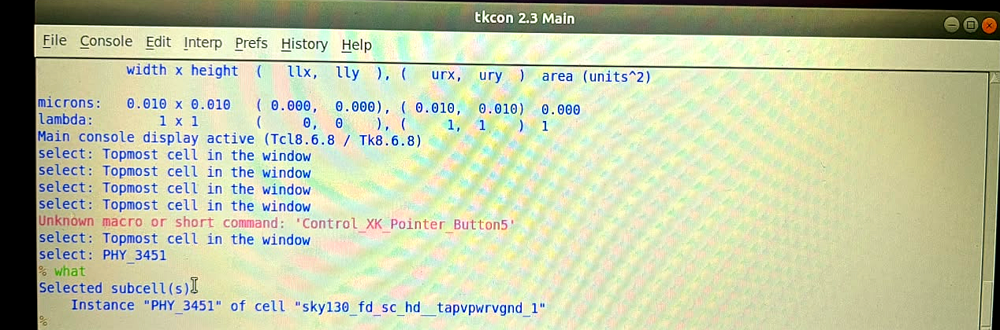

# Day 4: Floorplanning (run_floorplan)

## Design

- Design name: picorv32a
- Tool: OpenROAD (floorplan + PDN engine), Magic (layout viewer)

## Steps Performed

### 1. Run Floorplan

Executed `run_floorplan` inside the OpenLane interactive flow, continuing from the synthesized netlist.

```tcl
run_floorplan
```

### 2. Explore the Configuration Folder

Before/alongside the run, checked the `configuration` directory to understand which variables control the floorplan stage:

```bash
cd ~/Desktop/work/tools/openlane_working_dir/openlane/configuration
pwd
ls -ltr
less README.md
```

`README.md` in this folder lists every OpenLane variable along with a description — organized by flow stage (Floorplanning, Placement, CTS, etc.) — which is what was referenced to look up `FP_CORE_UTIL`, `FP_PDN_*`, and the other floorplan variables used below.

**Config file priority (highest to lowest):**

```
1. sky130A_sky130_fd_sc_hd_config.tcl   (PDK/std-cell-library-specific overrides)
2. config.tcl                            (design-specific settings)
3. configuration/*.tcl                   (OpenLane global defaults, incl. floorplan.tcl)
```

A variable set in a higher-priority file overrides the same variable's default from a lower-priority file. This is how, for example, `FP_CORE_UTIL` ends up as `35` for this run instead of the tool's default of `50`.

### 3. Inspect Floorplan Results

Navigated to the run's results directory to check the generated files:

```bash
cd designs/picorv32a/runs/10-08_08-16/results/floorplan
ls -ltr
```

Output confirmed the floorplan stage generated:
- `merged_unpadded.lef`
- `picorv32a.floorplan.def`
- `picorv32a.floorplan.def.png`



### 4. Read the Floorplan DEF File

```bash
less picorv32a.floorplan.def
```

Key values extracted from the DEF header:

```
DESIGN picorv32a ;
UNITS DISTANCE MICRONS 1000 ;
DIEAREA ( 0 0 ) ( 660685 671405 ) ;
ROW ROW_0 unithd 5520 10880 FS DO 1412 BY 1 STEP 460 0 ;
ROW ROW_1 unithd 5520 13600 N  DO 1412 BY 1 STEP 460 0 ;
...
```



**Die area calculation:**

The `DIEAREA` statement gives the lower-left `(x, y)` and upper-right `(x, y)` corners in the DEF's distance units (1000 units = 1 micron):

```
Lower-left  (x, y) = (0, 0)
Upper-right (x, y) = (660685, 671405)  →  (660.685 µm, 671.405 µm)

Die width  = 660.685 µm
Die height = 671.405 µm
Die area   = 660.685 × 671.405 ≈ 443,588 µm²
```

### 5. Check the Applied Floorplan Configuration

Compared the default values in `configuration/floorplan.tcl` against the actual resolved values for this run by reading `config.tcl` in the run directory:

```bash
less config.tcl
```

Reviewed the actual floorplan variables OpenLane used for this run (`config.tcl` values, resolved against `floorplan.tcl` defaults):



Key settings:

| Variable | Value | Meaning |
|---|---|---|
| FP_CORE_UTIL | 35 | Core utilization target (%) |
| FP_ASPECT_RATIO | 1 | Height/width ratio of the core |
| FP_CORE_MARGIN | 0 | Core margin from die boundary |
| FP_IO_MODE | 1 | Random-equidistant I/O pin placement |
| FP_PDN_VPITCH / FP_PDN_HPITCH | 153.6 / 153.18 | Vertical/horizontal power stripe pitch |
| FP_PDN_LOWER_LAYER / UPPER_LAYER | met4 / met5 | Power distribution network metal layers |

### 6. Check the Floorplan Log

Navigated to the run's log folder to review the I/O placer log for this stage:

```bash
cd designs/picorv32a/runs/10-08_08-16/logs/floorplan
ls -ltr
less io_placer.log
```

### 7. Verify Component/Net Counts via OpenROAD Log

`run_floorplan` internally invokes OpenROAD to read the merged LEF and the synthesized DEF:



```
Notice 0: Created 13 technology layers
Notice 0: Created 25 technology vias
Notice 0: Created 440 library cells
Notice 0: Design: picorv32a
Notice 0:     Created 409 pins.
Notice 0:     Created 14876 components and 115597 component-terminals.
Notice 0:     Created 14978 nets and 56051 connections.
```

Component and net counts match the synthesis netlist exactly (14876 cells, 14978 nets) — confirming a clean handoff from synthesis to floorplanning.

### 8. View the Floorplan in Magic

Opened the generated floorplan layout in Magic for visual inspection:

```bash
magic -T /home/vsduser/Desktop/work/tools/openlane_working_dir/pdks/sky130A/libs.tech/magic/sky130A.tech \
  lef read ../../tmp/merged.lef \
  def read picorv32a.floorplan.def &
```

**Magic navigation used:**
- Click left, then right → draws a box around the region to zoom into (lower-left and upper-right corners)
- `Z` → zoom in to the boxed region
- `S` → select the object under the cursor
- `V` → view/zoom to fit the current selection
- Console command `what` → prints identity of the currently selected cell/subcell



The layout shows the die boundary with standard-cell placement rows (vertical tap/decap columns visible), matching the row/step values from the DEF file.

### 9. Inspect an Individual Standard Cell

Zoomed into a single placed cell to inspect its instance name and cell type:



The zoomed view shows a `tapvpwrvgnd` (tap cell providing VPWR/VGND connections) with its physical instance labels (`PHY_3500`, `PHY_3451`) visible in the layout.

Selected the cell (`S`) and queried it from the Magic **tkcon** console using the `what` command:

```tcl
% what
Selected subcell(s)
    Instance "PHY_3451" of cell "sky130_fd_sc_hd__tapvpwrvgnd_1"
```



This confirms the selected cell is a `sky130_fd_sc_hd__tapvpwrvgnd_1` tap cell — used to provide well-tap and substrate connections at regular intervals across the floorplan, as required by the SKY130 DRC rules.

### 10. Result

Floorplan stage completed successfully — die area, rows, I/O pin placement, and the power distribution network were all generated and verified against the synthesis netlist before proceeding to placement.