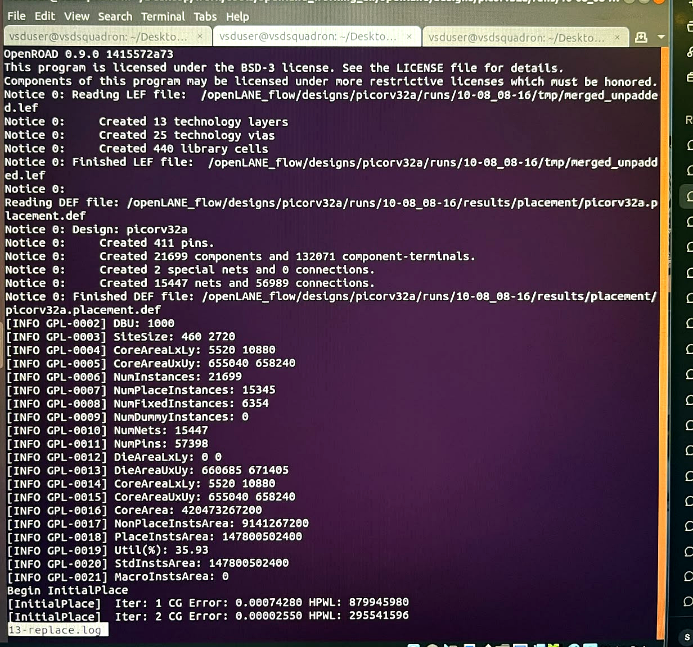
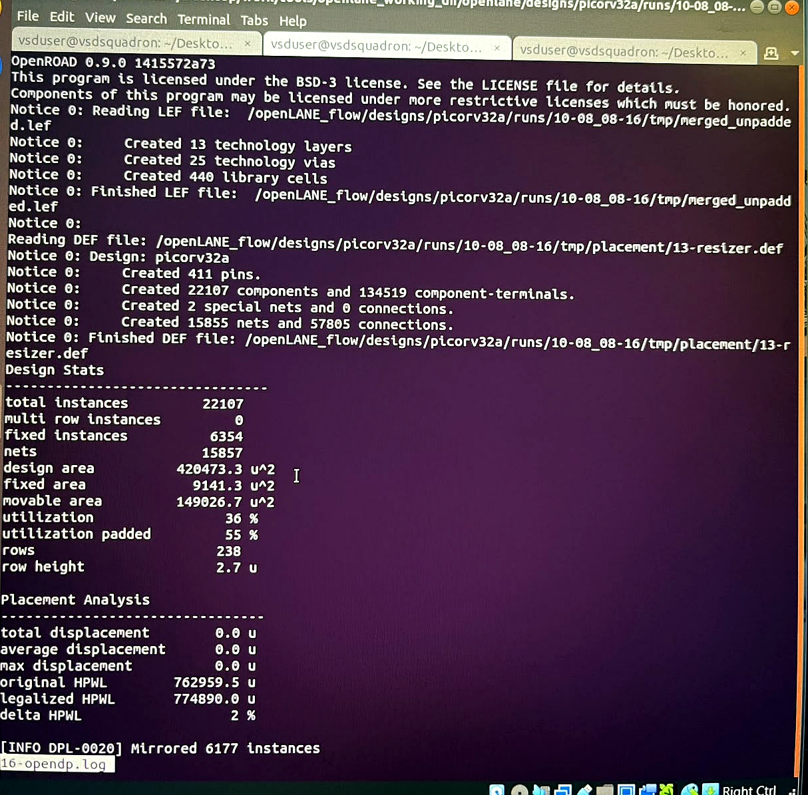
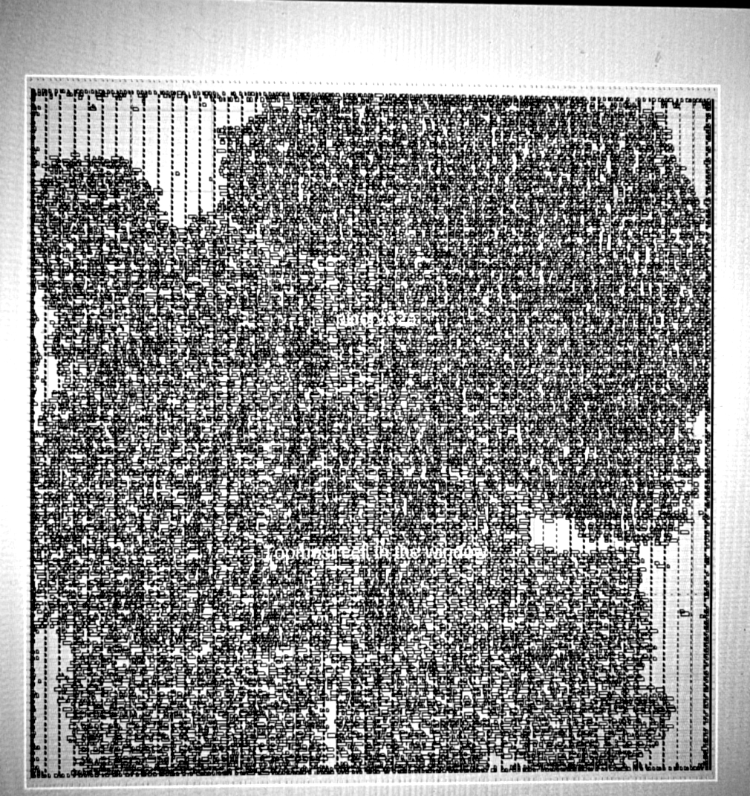
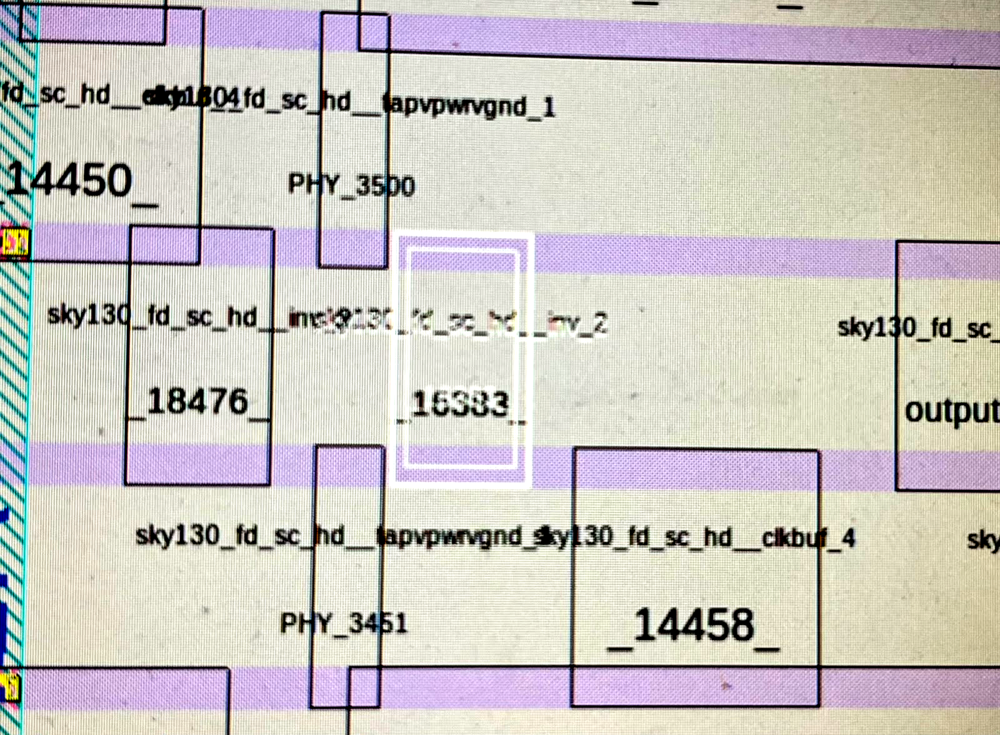
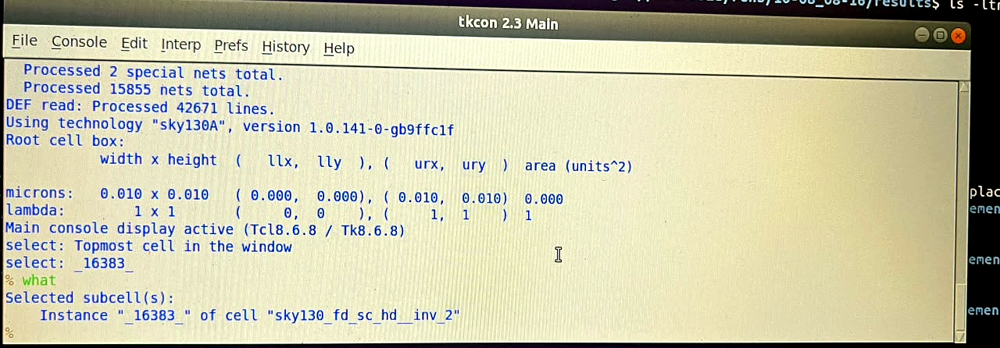

# Day 5: Placement (run_placement)

## Design

- Design name: picorv32a
- Tools: RePlAce (global placement), OpenDP (detailed placement/legalization), Magic (layout viewer)

## Steps Performed

### 1. Run Placement

Executed `run_placement` inside the OpenLane interactive flow, continuing from the floorplanned design.

```tcl
run_placement
```

Placement runs in two phases: **global placement** (RePlAce) roughly positions all cells to minimize wirelength, followed by **detailed placement** (OpenDP) which legalizes those positions onto valid standard-cell rows/sites.

### 2. Locate the Placement Logs

Each OpenLane step logs to a numbered file. For this run, global placement logged to `13-replace.log` and detailed placement to `16-opendp.log`:

```bash
cd designs/picorv32a/runs/10-08_08-16/logs/placement
ls -ltr
```

To confirm which step number maps to which stage, cross-checked against the run's command log:

```bash
cd designs/picorv32a/runs/10-08_08-16
less cmds.log
```

### 3. Global Placement Log (13-replace.log)

```bash
less 13-replace.log
```



Key stats from the log: die area spans (0, 0) to (660685, 671405), with the core area at (5520, 10880) to (655040, 658240) — giving a core area of ~420.5 billion DBU². The design has 21,699 total instances (15,345 placeable, 6,354 fixed), 15,447 nets, and 57,398 pins, at 35.93% utilization.

**InitialPlace convergence** (conjugate-gradient solver reducing wirelength error each iteration):

```
[InitialPlace]  Iter: 1  CG Error: 0.00074280  HPWL: 879945980
[InitialPlace]  Iter: 2  CG Error: 0.00002550  HPWL: 295541596
```

HPWL (half-perimeter wirelength) dropped by roughly 66% between the first two iterations as the solver converges toward a low-wirelength initial placement.

### 4. Detailed Placement Log (16-opendp.log)

```bash
less 16-opendp.log
```



**Design Stats:** 22,107 total instances (6,354 fixed), 15,857 nets, design area 420,473.3 µm² with 149,026.7 µm² movable, giving 36% utilization (55% padded), across 238 rows of height 2.7 µm.

**Placement Analysis (legalization result):**

```
total displacement      0.0 u
average displacement    0.0 u
max displacement        0.0 u
original HPWL      762959.5 u
legalized HPWL      774890.0 u
delta HPWL               2 %
```

A 2% HPWL delta between the pre-legalization and post-legalization placement is a good result — it means legalizing cell positions onto valid rows/sites barely increased total wirelength. `[INFO DPL-0020] Mirrored 6177 instances` — OpenDP flipped roughly a quarter of the cells to align them correctly with alternating row orientations (FS/N rows from the floorplan DEF).

### 5. Inspect Placement Results Directory

```bash
cd designs/picorv32a/runs/10-08_08-16/results/placement
ls -ltr
```

Confirmed `picorv32a.placement.def` was generated — component and net counts read back from it (21,699 components, 15,447 nets) match the global placement log above.

### 6. View the Placement in Magic

Opened the placed layout in Magic the same way as the floorplan stage:

```bash
magic -T /home/vsduser/Desktop/work/tools/openlane_working_dir/pdks/sky130A/libs.tech/magic/sky130A.tech \
  lef read ../../tmp/merged.lef \
  def read picorv32a.placement.def &
```



Compared to the floorplan stage (empty rows with only tap/decap cells), the layout is now densely packed with logic cells across the entire core area.

### 7. Inspect an Individual Placed Cell

Zoomed into a small region to see individual placed cells and their instance names:

```
Click left, then right → box the region to zoom into
Z → zoom in
S → select a cell
```



Selected instance `_16383_` and queried it from the tkcon console:

```tcl
% what
Selected subcell(s):
    Instance "_16383_" of cell "sky130_fd_sc_hd__inv_2"
```



Confirms `_16383_` is a `sky130_fd_sc_hd__inv_2` (inverter) cell, placed and legalized onto its row alongside neighboring `tapvpwrvgnd`, `clkbuf_4`, and other standard cells visible in the zoomed view.

### 8. Result

Placement completed successfully — global placement converged to a low-wirelength initial layout, and detailed placement legalized all cells onto valid rows with only a 2% increase in wirelength (774,890 u vs. 762,959.5 u original HPWL). Design ready to proceed to Clock Tree Synthesis (CTS).
