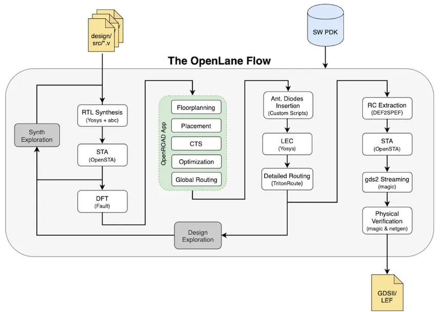
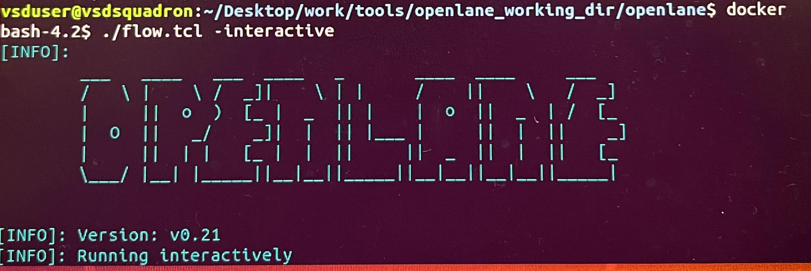
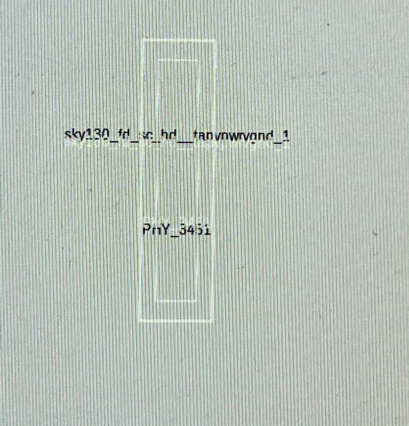
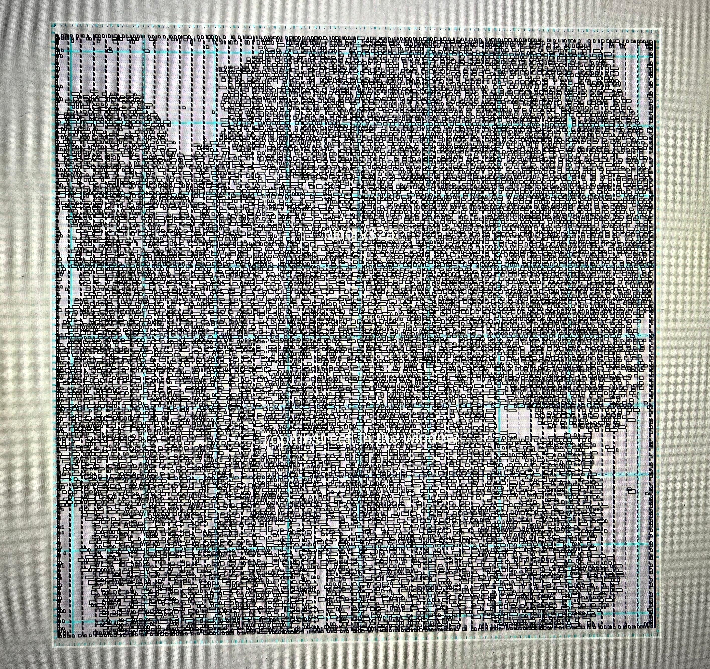
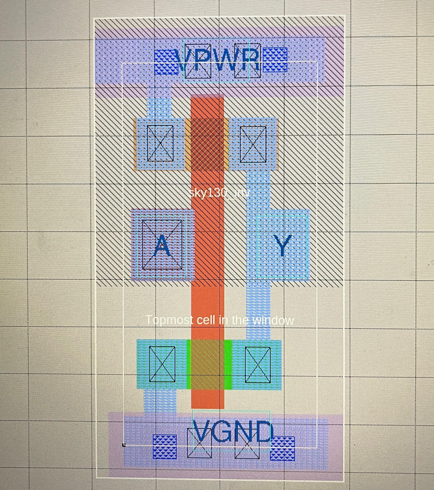
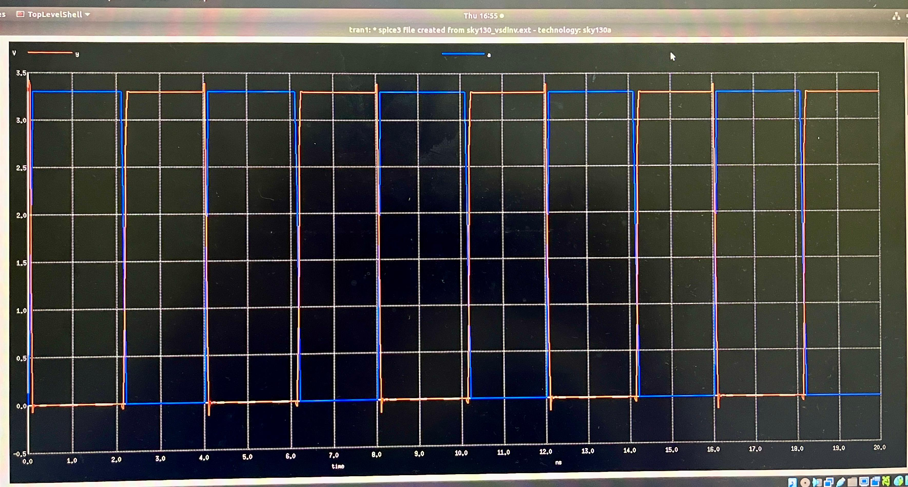
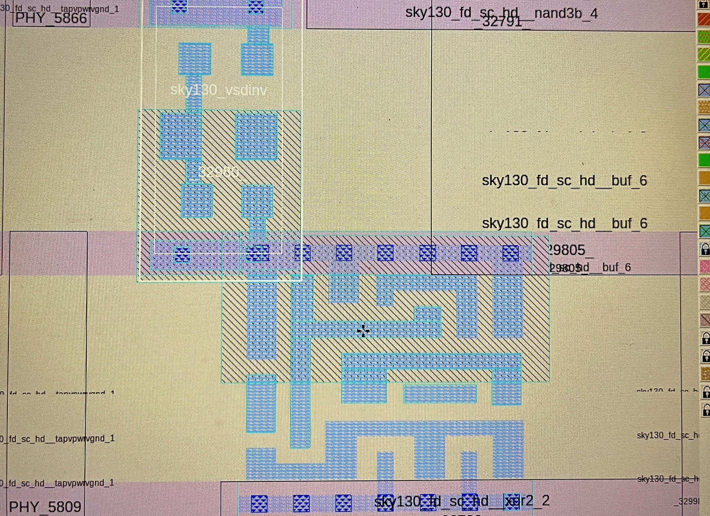

# VLSI Physical Design & RTL-to-GDSII Flow using OpenLane

A hands-on implementation of an RTL-to-GDSII physical design flow using [OpenLane](https://github.com/The-OpenROAD-Project/OpenLane) and the open-source [SKY130 PDK](https://github.com/google/skywater-pdk).



This repository documents actual tool execution, environment setup, debugging, and physical-design observations made while running real designs (`spm`, `picorv32a`) through the OpenLane flow — not just lecture notes.

Primary environment: the PnR flow itself is run locally, inside a VirtualBox Ubuntu VM with OpenLane/Docker set up on the machine directly. A GitHub Codespace was separately set up and verified as a working backup/alternative environment. This GitHub repository is used only to document and upload results after each run — it does not host the actual flow execution.

## Physical Design Flow

Each stage feeds directly into the next:

- **Synthesis** turns Verilog RTL into a gate-level netlist built from real, pre-characterized standard cells.
- **Floorplanning** decides the chip's physical size and where I/O pins and major blocks sit.
- **Power Planning** builds the power/ground distribution grid every cell will connect to.
- **Placement** assigns exact physical (x, y) coordinates to every gate from synthesis.
- **CTS** builds a balanced clock distribution network so all sequential elements switch together.
- **Routing** draws the actual metal wires connecting placed cells.
- **Sign-off** runs DRC/LVS/STA checks to confirm the design is manufacturable and meets timing.
- **GDSII** is the final geometric file format sent to a foundry for fabrication.

Each stage above takes the design one step closer to a manufacturable layout. This repository tracks progress through that flow, one stage at a time, using two working environments: a local VirtualBox/Docker setup and a cloud-based GitHub Codespace.

## Tools & Technologies

- **OpenLane** — automated RTL-to-GDSII flow, orchestrating the tools below
- **SKY130 PDK** — Google/SkyWater's open-source 130nm process design kit
- **Yosys** — RTL synthesis (Verilog → gate-level netlist)
- **OpenROAD** — floorplanning, placement, CTS, routing, static timing analysis
- **Magic** — VLSI layout viewing/editing, DRC, GDSII generation
- **Ngspice** — circuit-level SPICE simulation, used for standard cell characterization
- **Tcl** — scripting language used to control the flow (`flow.tcl` and related scripts)
- **Docker** — packages OpenLane's tools into a reproducible container
- **Linux (Ubuntu)** — host OS, run both locally (VirtualBox) and in the cloud (GitHub Codespaces)

## References

- OpenLane documentation: https://openlane.readthedocs.io
- SKY130 PDK: https://github.com/google/skywater-pdk

---

## 1. Environment Setup

### Objective

Before any RTL can be pushed through synthesis, placement, or routing, a working OpenLane environment is required. This covers setting up two independent environments capable of running OpenLane:
1. A local VirtualBox virtual machine (offline-capable)
2. A cloud-based GitHub Codespace (browser-based, no local install)

Both were brought to a fully working state — confirmed by successfully running a design through the flow. The VirtualBox environment is the primary machine used for the actual PnR (Place-and-Route) flow in later days; the Codespace serves as a verified backup environment.

### Environment / Tools

- Oracle VirtualBox (local virtualization)
- Ubuntu (guest OS, via a pre-built `.vdi` disk image)
- Docker (containerized OpenLane tools)
- GitHub Codespaces (cloud dev environment)
- OpenLane v0.21 (local) / OpenLane (via `ghcr.io/the-openroad-project/openlane`, cloud)

### Workflow

```
Download VDI / Codespace repo
   ↓
Set up virtualization (VirtualBox) or cloud container (Codespaces)
   ↓
Resolve Docker image/alias issues
   ↓
Launch OpenLane
   ↓
Ready for RTL synthesis
```

### Local (VirtualBox) Setup

- Downloaded the workshop's `.vdi` disk image and loaded it into VirtualBox as an existing virtual hard disk.
- Configured the VM with 4096 MB RAM and multiple CPUs, using the existing `openlane.vdi`.
- Booted the VM into a pre-configured Ubuntu desktop with the OpenLane repo already present under `~/Desktop/work/tools/openlane_working_dir/`.

### Cloud (Codespaces) Setup

- Created a GitHub account and opened the `vsdip/vsd-openlane` repository.
- Used "Create codespace on main" to spin up a cloud Ubuntu environment with OpenLane, Magic, and the SKY130 PDK pre-installed via a devcontainer setup.
- Confirmed the container's Docker installation with `docker --version`.

### Issues Faced

**Problem:** Running `make mount` (local VM) failed with:

```
Unable to find image 'efabless/openlane:current' locally
docker: Error response from daemon: manifest for efabless/openlane:current not found
```

**Cause:** The Docker image tag referenced by the workshop's Makefile (`efabless/openlane:current`) no longer exists on Docker Hub — Efabless had changed/retired that specific tag.

**Resolution:** Investigation showed the `docker` command on this VM was actually aliased to a fixed `docker run` invocation pointing at a specific, already-downloaded image tag: `efabless/openlane:v0.21`. Running `docker` (bypassing arguments that were being swallowed by the alias) revealed this. Using `\docker pull efabless/openlane:v0.21` (the backslash bypasses shell aliases) confirmed the correct image was already present locally (`Status: Image is up to date`). Running the bare `docker` alias afterward correctly launched an interactive shell inside the OpenLane v0.21 container.


### Key Takeaway

A correctly configured environment is a prerequisite for everything downstream — every later stage (synthesis, floorplanning, placement) depends on OpenLane's tools (Yosys, OpenROAD, Magic) being reachable inside a working container with the SKY130 PDK properly linked. Environment issues (like a stale Docker tag, or a broken shell alias) can look like tool failures but are actually infrastructure problems — worth debugging systematically (checking `docker images`, log output, and aliases) rather than assuming the tools themselves are broken.

---

## 2. Design Prep

### Design

- Design name: `picorv32a`
- Source: OpenLane example designs
- Technology node: SKY130 (130nm)

### Steps Performed

**1. Pull OpenLane Docker Image**

```bash
\docker pull efabless/openlane:v0.21
```
**2. Launch OpenLane in Interactive Mode**

From the OpenLane working directory:

```bash
docker
./flow.tcl -interactive
```

Output confirmed:
```
OpenLane version: v0.21
Running interactively
```



**3. Load the OpenLane Package and Start Design Prep**

Inside the OpenLane interactive Tcl shell:

```tcl
package require openlane 0.9
prep -design picorv32a
```

`package require openlane 0.9` loads the OpenLane Tcl package (version 0.9) into the interactive shell — this is what makes commands like `prep`, `run_synthesis`, `run_floorplan`, etc. available. `prep -design picorv32a` then triggers the actual design prep run for the `picorv32a` design.

## 3. Synthesis (`run_synthesis`)

### Design

- Design name: `picorv32a`
- Tool: Yosys (synthesis), OpenSTA (post-synthesis timing check)

### Steps Performed

**1. Run Synthesis**

Executed `run_synthesis` inside the OpenLane interactive flow. Yosys mapped the RTL to the SKY130 standard cell library (`sky130_fd_sc_hd`).

**2. Synthesis Statistics**

```
=== picorv32a ===
Number of wires:               14596
Number of wire bits:           14978
Number of public wires:         1565
Number of public wire bits:     1947
Number of memories:                0
Number of memory bits:             0
Number of processes:               0
Number of cells:               14876
```

Key cell counts from the mapped netlist:

| Cell Type | Count | Notes |
|---|---|---|
| sky130_fd_sc_hd__dfxtp_2 | 1613 | D flip-flops |
| sky130_fd_sc_hd__buf_1 / buf_2 | 1664 | Buffers |
| sky130_fd_sc_hd__inv_2 | 1615 | Inverters |
| sky130_fd_sc_hd__mux2_1 | 1224 | 2:1 muxes |
| sky130_fd_sc_hd__a2bb2o_2 | 1748 | AOI/complex gate |
| sky130_fd_sc_hd__a22o_2 | 1013 | AND-OR gate |
| **Total cells** | **14876** | |

**3. Flop Ratio**

```
Flop Ratio = Number of D Flip-Flops / Total Number of Cells
           = 1613 / 14876
           ≈ 0.1084  (10.84%)
```

**4. Post-Synthesis Static Timing Analysis (STA)**

`run_synthesis` automatically triggers OpenSTA to check timing on the synthesized netlist.
Two default operating conditions (`ff_n40C_1v95`, `ss_100C_1v60`) weren't found in the liberty files — flagged as warnings, not blocking. Clock created on `CLOCK_PORT`; input/output delay 4.946 ns; output load 0.01765 (from `SYNTH_CAP_LOAD`).


| Metric | Value |
|---|---|
| TNS (Total Negative Slack) | -759.46 |
| WNS (Worst Negative Slack) | -24.89 |

Negative slack at this stage is expected — this is the baseline synthesis netlist before any timing-driven optimization in later PD stages (placement, CTS).

**5. Result**

```
[INFO]: Synthesis was successful
```

Synthesis completed with 307 unique warning messages (no errors); netlist ready for floorplanning.

---

## 4. Floorplanning (`run_floorplan`)

### Design

- Design name: `picorv32a`
- Tool: OpenROAD (floorplan + PDN engine), Magic (layout viewer)

### Steps Performed

**1. Run Floorplan**

Executed `run_floorplan` inside the OpenLane interactive flow, continuing from the synthesized netlist.

```
run_floorplan
```

**2. Config Variables**

Checked `configuration/floorplan.tcl` for variable definitions, then compared against the resolved `config.tcl` for this run to see which values OpenLane actually applied.

Config file priority (highest to lowest): `sky130A_sky130_fd_sc_hd_config.tcl` → `config.tcl` → `configuration/*.tcl`. A variable set in a higher-priority file overrides the same variable's default from a lower-priority file — this is how `FP_CORE_UTIL` ends up as 35 for this run instead of the tool's default of 50.

| Variable | Value | Meaning |
|---|---|---|
| `FP_CORE_UTIL` | 35 | Core utilization target (%) |
| `FP_ASPECT_RATIO` | 1 | Height/width ratio of the core |
| `FP_CORE_MARGIN` | 0 | Core margin from die boundary |
| `FP_IO_MODE` | 1 | Random-equidistant I/O pin placement |
| `FP_PDN_VPITCH` / `FP_PDN_HPITCH` | 153.6 / 153.18 | Vertical/horizontal power stripe pitch |
| `FP_PDN_LOWER_LAYER` / `UPPER_LAYER` | met4 / met5 | Power distribution network metal layers |

**3. Floorplan Results**

```bash
cd designs/picorv32a/runs/10-08_08-16/results/floorplan
ls -ltr
# merged_unpadded.lef, picorv32a.floorplan.def, picorv32a.floorplan.def.png
```

DEF die area, read from the header of `picorv32a.floorplan.def`:

```
DIEAREA ( 0 0 ) ( 660685 671405 ) ;

Lower-left  (x, y) = (0, 0)
Upper-right (x, y) = (660685, 671405)  →  (660.685 µm, 671.405 µm)

Die width  = 660.685 µm
Die height = 671.405 µm
Die area   = 660.685 × 671.405 ≈ 443,588 µm²
```

**4. Verify Component/Net Counts (OpenROAD Log)**

`run_floorplan` internally invokes OpenROAD to read the merged LEF and the synthesized DEF:

```
Notice 0: Created 13 technology layers
Notice 0: Created 25 technology vias
Notice 0: Created 440 library cells
Notice 0: Design: picorv32a
Notice 0:     Created 409 pins.
Notice 0:     Created 14876 components and 115597 component-terminals.
Notice 0:     Created 14978 nets and 56051 connections.
```

Component and net counts match the synthesis netlist exactly (14876 cells, 14978 nets) — confirming a clean handoff from synthesis to floorplanning.

**5. View the Floorplan in Magic**

```bash
magic -T /home/vsduser/Desktop/work/tools/openlane_working_dir/pdks/sky130A/libs.tech/magic/sky130A.tech \
  lef read ../../tmp/merged.lef \
  def read picorv32a.floorplan.def &
```

The layout shows the die boundary with standard-cell placement rows (vertical tap/decap columns visible), matching the row/step values from the DEF file.



Zoomed into a single placed cell and queried it via the tkcon console `what` command — confirmed a `sky130_fd_sc_hd__tapvpwrvgnd_1` tap cell (`PHY_3451`), used to provide well-tap and substrate connections at regular intervals across the floorplan, as required by SKY130 DRC rules:

```tcl
% what
Selected subcell(s)
    Instance "PHY_3451" of cell "sky130_fd_sc_hd__tapvpwrvgnd_1"
```

**6. Result**

Floorplan stage completed successfully — die area, rows, I/O pin placement, and the power distribution network were all generated and verified against the synthesis netlist before proceeding to placement.


## 5. Placement (`run_placement`)

### Design

- Design name: `picorv32a`
- Tools: RePlAce (global placement), OpenDP (detailed placement/legalization), Magic (layout viewer)

### Steps Performed

**1. Run Placement**

```
run_placement
```

Placement runs in two phases: global placement (RePlAce) roughly positions all cells to minimize wirelength, followed by detailed placement (OpenDP) which legalizes those positions onto valid standard-cell rows/sites.

**2. Global Placement (`13-replace.log`)**

```bash
cd designs/picorv32a/runs/10-08_08-16/logs/placement
less 13-replace.log
```

| Metric | Value |
|---|---|
| Die area | (0, 0) → (660685, 671405) |
| Core area | (5520, 10880) → (655040, 658240) ≈ 420.5B DBU² |
| Instances | 21,699 total (15,345 placeable, 6,354 fixed) |
| Nets / Pins | 15,447 / 57,398 |
| Utilization | 35.93% |

InitialPlace convergence (conjugate-gradient solver minimizing wirelength):

```
[InitialPlace]  Iter: 1  CG Error: 0.00074280  HPWL: 879945980
[InitialPlace]  Iter: 2  CG Error: 0.00002550  HPWL: 295541596
```

HPWL (half-perimeter wirelength) dropped ~66% between the first two iterations as the solver converges toward a low-wirelength initial placement.

**3. Detailed Placement / Legalization (`16-opendp.log`)**

```bash
less 16-opendp.log
```

Design stats: 22,107 total instances (6,354 fixed), 15,857 nets, design area 420,473.3 µm² (149,026.7 µm² movable) → 36% utilization (55% padded), across 238 rows of height 2.7 µm.

Legalization result:

```
total displacement      0.0 u
average displacement    0.0 u
max displacement        0.0 u
original HPWL      762959.5 u
legalized HPWL      774890.0 u
delta HPWL               2 %
```

A 2% HPWL delta between pre- and post-legalization placement is a good result — legalizing cell positions onto valid rows/sites barely increased total wirelength. `[INFO DPL-0020] Mirrored 6177 instances` — OpenDP flipped roughly a quarter of the cells to align them with alternating row orientations (FS/N rows from the floorplan DEF).

**4. Verify Results**

```bash
cd designs/picorv32a/runs/10-08_08-16/results/placement
ls -ltr
# picorv32a.placement.def
```

Component and net counts read back from the DEF (21,699 components, 15,447 nets) match the global placement log above.

**5. View the Placement in Magic**

```bash
magic -T /home/vsduser/Desktop/work/tools/openlane_working_dir/pdks/sky130A/libs.tech/magic/sky130A.tech \
  lef read ../../tmp/merged.lef \
  def read picorv32a.placement.def &
```

Compared to the floorplan stage (empty rows with only tap/decap cells), the layout is now densely packed with logic cells across the entire core area.




**6. Result**

Placement completed successfully — global placement converged to a low-wirelength initial layout, and detailed placement legalized all cells onto valid rows with only a 2% increase in wirelength (774,890 u vs. 762,959.5 u original HPWL). 

## Note: Re-running the flow with the custom standard cell

Up to this point, the picorv32a design was run through OpenLane using only the stock `sky130_fd_sc_hd` library. Starting with the next section, a custom inverter cell was designed, characterized in Ngspice, and (pending) DRC-checked — see Section 6 below. Once verified, this cell will be added to the library path, and the same PnR flow (synthesis → floorplan → placement → CTS → routing → signoff) will be re-run on `picorv32a` using the updated library.

The steps and tools are identical to Sections 2–5 above — that re-run section will focus on what changed (the config/library addition, and the commands run) rather than re-explaining concepts already covered.

---

## 6. Standard Cell Design — Extraction & Ngspice Characterization

## Objective

Before the custom standard cell (`sky130_inv.mag`, containing the `sky130_vsdinv` inverter subcircuit) can be added to the standard-cell library and re-integrated into the picorv32a design, it needs to be electrically characterized. This means extracting a SPICE netlist from the physical layout and running transient simulation in Ngspice to confirm correct switching behavior and measure timing parameters (rise time, fall time, slew).

## 1. Setup

Cloned the reference standard-cell design repository containing the inverter layout:

```bash
git clone https://github.com/nickson-jose/vsdstdcelldesign.git
cd vsdstdcelldesign
ls -ltr
```

```
README.md
LICENSE
Images/
extras/
libs/
sky130_inv.mag
```

Copied the Sky130 Magic technology file into this directory so Magic can correctly interpret and extract the layout using the right process rules:

```bash
cd ../../pdks/sky130A/libs.tech/magic
ls
# bump_bond_generator  generate_fill.py  sky130A-BindKeys  sky130A.magicrc  sky130A.tech
# check_density.py     seal_ring_generator  sky130A-GDS.tech  sky130A.tcl

cp sky130A.tech /home/vsduser/Desktop/work/tools/openlane_working_dir/openlane/vsdstdcelldesign
```

## 2. Open the Layout in Magic

```bash
cd ~/Desktop/work/tools/openlane_working_dir/openlane/vsdstdcelldesign
magic -T sky130A.tech sky130_inv.mag &
```


This opens the inverter layout with DRC checking enabled, showing the standard I/O ports (`A`, `Y`) and supply rails (`VPWR`, `VGND`) as laid out in silicon — poly, diffusion, and metal1 layers connecting the NMOS/PMOS pair that make up the inverter.

## 3. Extract SPICE Netlist from Layout

Inside Magic's `tkcon` console:

```tcl
% pwd
/home/vsduser/Desktop/work/tools/openlane_working_dir/openlane/vsdstdcelldesign

% extract all
Extracting sky130_inv into sky130_inv.ext:

% ext2spice cthresh 0 rthresh 0
% ext2spice
exttospice finished.
```

**What these commands do:**

| Command | Purpose |
|---|---|
| `extract all` | Extracts the circuit topology (transistors, connectivity) from the layout into `sky130_inv.ext` |
| `ext2spice cthresh 0 rthresh 0` | Configures the extraction-to-SPICE converter to include **all** parasitic capacitance and resistance, no matter how small (thresholds set to 0 rather than filtering out "insignificant" parasitics) — gives the most accurate, layout-derived netlist |
| `ext2spice` | Performs the actual conversion, producing `sky130_inv.spice` |

```bash
ls -ltr
# ...
# sky130_inv.ext      1365 bytes
# sky130_inv.spice     404 bytes
```

## 4. Edit the SPICE Deck for Simulation

The raw extracted netlist only contains the transistor-level circuit. To actually simulate it, supply sources, an input stimulus, and simulation control statements were added manually:

```bash
vim sky130_inv.spice
```
Final simulation-ready netlist:

```spice
* SPICE3 file created from sky130_vsdinv.ext - technology: sky130A

.option scale=0.01u
.include ./libs/pshort.lib
.include ./libs/nshort.lib

//.subckt sky130_vsdinv A Y VPWR VGND

M0 Y A VGND VGND nshort_model.0 w=35 l=23
+  ad=1435 pd=152 as=1365 ps=148
M1 Y A VPWR VPWR pshort_model.0 w=37 l=23
+  ad=1443 pd=152 as=1517 ps=156
VSS VGND 0 0V
VDD VPWR 0 3.3V
Va A VGND PULSE(0V 3.3V 0 0.1ns 0.1ns 2ns 4ns)
C0 VPWR Y 0.117fF
C1 A Y 0.0754fF
C2 A VPWR 0.0774fF
C3 Y VGND 0.279fF
C4 A VGND 2fF
C5 VPWR VGND 0.781fF
//.ends
.tran 1n 20n
.control
run
.endc
.end
```

## 5. Run the Simulation

```bash
ngspice sky130_inv.spice
```

```
** ngspice-27 : Circuit level simulation program


`Y = 3.3V` when `A = 0V` confirms correct inverting behavior at the very start of simulation, before the input pulse begins toggling.

```

## 6. Plot and Measure

```
ngspice 1 -> plot y a
```



The output (Y) correctly tracks the inverse of the input (A) across all pulse cycles in the 20ns window, with a visible propagation delay between each input edge and the corresponding output edge.

### Threshold-crossing measurements

Using the plot cursor, threshold-crossing points were read off the waveform:

| Reading | Time (x0) | Voltage (y0) | Threshold |
|---|---|---|---|
| Crossing 1 | 2.14998 ns | 1.65008 V | 50% VDD — input edge |
| Crossing 2 | 2.18598 ns | 1.65001 V | 50% VDD — output edge |

**Propagation delay** (from crossings 1 & 2, both at the 50% VDD threshold on the same transition):

```
t_pd = t(output @ 50%) − t(input @ 50%)
     = 2.18598 ns − 2.14998 ns
     = 0.036 ns  (36 ps)
```

## Key Takeaways

- Extracting with `cthresh 0 rthresh 0` ensures the SPICE netlist captures every parasitic from the actual layout — this is what makes the switching behavior in simulation reflect real silicon rather than an idealized schematic
- The PMOS (`M1`, W=0.37µm) is sized slightly wider than the NMOS (`M0`, W=0.35µm), compensating for the lower hole mobility so pull-up and pull-down drive strength are reasonably balanced
- Propagation delay, measured at the 50% VDD threshold, characterizes how fast this cell can switch — critical for timing closure once it's integrated into the picorv32a library

---

## 7. DRC on Custom Cell

### Objective

Confirm the custom inverter layout (`sky130_inv.mag`) meets Sky130's design rules before it's added to the standard-cell library and re-integrated into the picorv32a design.

### Running the Check

```bash
magic -T sky130A.tech sky130_inv.mag &
```

```tcl
% drc check
% drc why
Transistor width < 0.42um (diff/tap.2)
% drc count total
Cell sky130_vsdinv has 4 error tiles.
```

**What this showed:** one violation type across 4 error tiles — the NMOS transistor's diffusion width is below Sky130's 0.42µm minimum. This traces back to the SPICE netlist from Section 6 (`M0 ... w=35 l=23` with `scale=0.01u` → W = 0.35µm), confirming the layout and netlist agree on the same undersized transistor.

Selecting the violating device confirmed the exact dimensions:

```tcl
% what
Selected mask layers:
    nmos

% box
microns:  0.230 x 0.350   ( 0.490, 0.410), ( 0.720, 0.760)
```

0.230µm = channel length, 0.350µm = channel width — the width needs to grow to at least 0.42µm.

### Fixing the Violation

The general approach for a minimum-width violation like this: grow the diffusion layer symmetrically on both sides of its center, rather than extending only one edge — this keeps the transistor properly centered relative to the poly gate and neighboring well/spacing, avoiding new violations from an uneven edit.

```tcl
% box grow n 0.035um
% box grow s 0.035um
% paint ndiff
```

After painting, the DRC check is re-run on the **whole cell** (not just the edited region) to confirm the fix is complete and hasn't introduced any new spacing or overhang violations elsewhere:

```tcl
% drc check
% drc why
% drc count total
```

```tcl
% drc check
% drc why
No errors found.
% drc count total
Cell sky130_vsdinv has 0 error tiles.
```

DRC-clean — the symmetric growth resolved the width violation without introducing new spacing or overhang violations.

### Key Takeaways

- A DRC width violation traces directly back to the transistor's actual sizing — the layout and the SPICE netlist describe the same physical geometry
- Growing a transistor dimension symmetrically (both edges) rather than one-sided keeps it centered relative to the gate and surrounding layers, avoiding secondary spacing/overhang violations
- DRC must be re-checked against the whole cell after any edit, not just the local region that was changed
---

## Integrating a Custom Standard Cell (sky130_vsdinv) into the OpenLane Flow — picorv32a
 
### Objective 
 
1. Extract a LEF view of a custom-designed inverter standard cell (`sky130_vsdinv`) from its Magic layout.
2. Integrate that custom cell (and the `sky130_fd_sc_hd` library `.lib` files) into the OpenLane `picorv32a` design.
3. Carry the design through synthesis/floorplan/placement/cts/routing/GDSII 
---
 
### 1. Generate the LEF for the custom cell in Magic
 
The custom cell layout (`sky130_vsdinv.mag`) was opened in Magic using the SkyWater 130 tech file, and its abstract (LEF) view was generated from the `tkcon` console.
 
```tcl
% lef write
```
 
Console output confirmed the LEF was generated successfully for the cell:
 
```
Generating LEF output sky130_vsdinv.lef for cell sky130_vsdinv:
Diagnostic: Write LEF header for cell sky130_vsdinv
Diagnostic: Writing LEF output for cell sky130_vsdinv
Diagnostic: Scale value is 0.010000
```
 
This produced `sky130_vsdinv.lef` in the working directory (`~/Desktop/work/tools/openlane_working_dir/openlane/vsdstdcelldesign`), alongside the existing cell files:
 
```
$ ls -ltr
README.md
LICENSE
Images/
extras/
libs/
sky130_inv.mag
sky130A.tech
sky130_inv.ext
sky130_inv.spice
sky130_vsdinv.mag
sky130_vsdinv.lef      <-- newly generated
```
 
The layout was opened for reference/verification with:
 
```bash
magic -T sky130A.tech sky130_inv.mag &
magic -T sky130A.tech sky130_vsdinv.mag &
```
 
---
 
### 2. Copy the custom LEF and standard-cell libraries into the design
 
The generated LEF was copied into the `picorv32a` design's `src` folder so OpenLane can pick it up as an extra LEF:
 
```bash
cp sky130_vsdinv.lef \
   /home/vsduser/Desktop/work/tools/openlane_working_dir/openlane/designs/picorv32a/src
```
 
The `.lib` timing files (fast/slow/typical) from the `libs/` folder were also copied into the same design `src` folder, so the custom cell's timing views are available to synthesis:
 
```bash
cd ~/Desktop/work/tools/openlane_working_dir/openlane/vsdstdcelldesign/libs
ls -ltr
# pshort.lib
# nshort.lib
# sky130A.tech
# sky130_fd_sc_hd__fast.lib
# sky130_fd_sc_hd__slow.lib
# sky130_fd_sc_hd__typical.lib
 
cp sky130_fd_sc_hd__* \
   /home/vsduser/Desktop/work/tools/openlane_working_dir/openlane/designs/picorv32a/src
```
 
---
 
### 3. Point the picorv32a `config.tcl` at the custom cell / libraries
 
`designs/picorv32a/config.tcl` was edited so that:
- The synthesis/STA libraries used are the ones just copied in.
- `EXTRA_LEFS` picks up any additional LEF (including `sky130_vsdinv.lef`) placed in `src/`.
```tcl
# Design
set ::env(DESIGN_NAME) "picorv32a"
 
set ::env(VERILOG_FILES) "./designs/picorv32a/src/picorv32a.v"
set ::env(SDC_FILE) "./designs/picorv32a/src/picorv32a.sdc"
 
set ::env(CLOCK_PERIOD) "24.730"
set ::env(CLOCK_PORT) "clk"
 
set ::env(CLOCK_NET) $::env(CLOCK_PORT)
 
set ::env(LIB_SYNTH)   "$::env(OPENLANE_ROOT)/designs/picorv32a/src/sky130_fd_sc_hd__typical.lib"
set ::env(LIB_FASTEST) "$::env(OPENLANE_ROOT)/designs/picorv32a/src/sky130_fd_sc_hd__fast.lib"
set ::env(LIB_SLOWEST) "$::env(OPENLANE_ROOT)/designs/picorv32a/src/sky130_fd_sc_hd__slow.lib"
set ::env(LIB_TYPICAL) "$::env(OPENLANE_ROOT)/designs/picorv32a/src/sky130_fd_sc_hd__typical.lib"
 
set ::env(EXTRA_LEFS) [glob $::env(OPENLANE_ROOT)/designs/$::env(DESIGN_NAME)/src/*.lef]
 
set filename $::env(OPENLANE_ROOT)/designs/$::env(DESIGN_NAME)/$::env(PDK)_$::env(STD_CELL_LIBRARY)
if { [file exists $filename] == 1 } {
    source $filename
}
```
 
> Note: `CLOCK_PERIOD` is `25.000` ns in this run, i.e. a 40 MHz target clock.
 
---
 
 
### 4. Launch OpenLane and prep the design
 
```bash
docker pull efabless/openlane:v0.21
docker run ...   # enter container
./flow.tcl -interactive
```
 
Inside the interactive Tcl shell:
 
```tcl
% package require openlane 0.9
% prep -design picorv32a -tag finalrun2
```
 
OpenLane sources `designs/picorv32a/config.tcl` and reports the merged LEF (standard cell LEF + the custom `sky130_vsdinv.lef`) being prepared for the run.
 
---
 
### 5. Setting the synthesis strategy variables
 
To push the custom-cell-integrated design toward better timing closure, the following environment variables were set **inside the interactive OpenLane session**, before running synthesis:
 
```tcl
set ::env(SYNTH_STRATEGY) "DELAY 0"
set ::env(SYNTH_MAX_FANOUT) 4
set ::env(SYNTH_SIZING) 1
```
 
What each of these does:
 
- **`SYNTH_STRATEGY "DELAY 0"`** — tells `yosys`/`abc` to optimize the mapped netlist for **delay** rather than area (OpenLane's default strategy is area-oriented). This generally increases cell count/area slightly but improves timing.
- **`SYNTH_MAX_FANOUT 4`** — caps the max fanout any synthesized gate is allowed to drive to 4 (down from the default of 10). Lower fanout means less capacitive loading per driver, which helps meet timing (less transition-time related slack), at the cost of extra buffering/cell count.
- **`SYNTH_SIZING 1`** — enables ABC's cell-sizing / gate-sizing optimization pass, letting synthesis pick larger-drive-strength cells where useful to fix timing, instead of using default-sized cells everywhere.
```tcl
% run_synthesis
```
 
---
 
### 6. Final Synthesis Results
 
Only the final synthesis run (with the strategy/fanout/sizing settings above) was kept. Its reports live under:
 
```
designs/picorv32a/runs/<tag>/reports/synthesis/
```

 
### Area — `1-yosys_0.stat.rpt`
 
```
Chip area for module 'picorv32a': 196832.528000
```
 
**Area = 196832.528 µm²**
 
### Max slew / capacitance — `2-opensta.slew.rpt`
 
| Pin | Limit | Cap | Slack |
|-----|-------|-----|-------|
| `_36261_/X` | 0.23 | 0.63 | **-0.40 (VIOLATED)** |
| `_36260_/X` | 0.23 | 0.42 | **-0.19 (VIOLATED)** |
 
Two nets exceed the max-capacitance limit at this stage — driven by high fanout/loading on those two nets, flagged as slew (max capacitance) violations.
 
### Setup / Hold timing — raw synthesized netlist (stage `2`, before resizer)
 
```
hold   - 0.24  slack (MET)
setup  9.12  slack (MET)
```
 
### Setup / Hold timing — after resizer (stage `12`, final synthesis-stage netlist)
 
This is where `SYNTH_STRATEGY`, `SYNTH_MAX_FANOUT`, and `SYNTH_SIZING` actually take effect (buffering/fanout fixing/gate sizing applied by the resizer):
 
```
hold  0.22  slack (MET)
setup 11.10 slack (MET)
```
 
### Worst/Total Negative Slack
 
```
wns 0.00
tns 0.00
```
 
 
### 7. Floorplan and Placement — verifying the custom cell was placed
 
After synthesis, the flow was continued through floorplan and placement:
 
```tcl
% run_floorplan
% run_placement
```
 
The resulting placement `DEF` was opened in Magic (via `tkcon`) to confirm the custom `sky130_vsdinv` cell was placed correctly among the standard `sky130_fd_sc_hd` cells:
 
```bash
cd runs/<tag>/results/placement
magic -T /path/to/sky130A.tech lef read ../../tmp/merged.lef def read picorv32a.placement.def &
```
 
In the Magic layout window, selecting one of the placed instances confirmed:
 
```tcl
% what
Selected subcell(s):
    Instance "_32980_" of cell "sky130_vsdinv"
```

 
This confirms `sky130_vsdinv` was successfully:
1. Recognized by OpenLane as a valid extra LEF/cell.
2. Included by synthesis in the mapped netlist.
3. Placed correctly in the floorplan alongside the standard `sky130_fd_sc_hd` cells.
---

## 10. Clock Tree Synthesis (CTS)

`[TO BE FILLED]` — pending.

---

## 11. Routing

`[TO BE FILLED]` — pending.

---

## 12. Sign-off (DRC / LVS / STA)

`[TO BE FILLED]` — pending.

---

## End-to-End Learning

`[TO BE FILLED]` — to be written once all stages above are complete, tying RTL → Synthesis → Floorplan → Power Planning → Placement → CTS → Routing → Signoff → GDSII together with how CMOS technology, standard cells, SPICE, PDK, LEF, Liberty, STA, and DRC support that flow.
