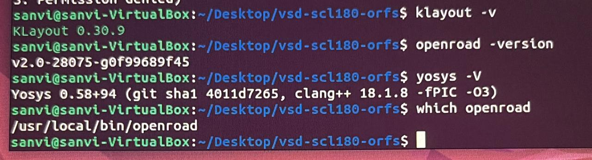
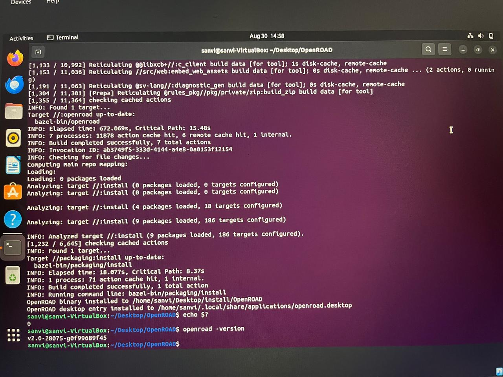

# Task 3.1: Install ORFS Locally

## Objective
Replicate the environment locally (self-owned machine) by cloning the ORFS repository, installing all required dependencies manually, and validating that Make, OpenROAD, Yosys, and KLayout are correctly installed and reachable via PATH.

## Environment
- Windows host, Oracle VirtualBox
- Ubuntu 22.04 (fresh VM, 80GB disk)

## Steps Performed

### 1. Cloned the repository
```bash
git clone https://github.com/vsdip/vsd-scl180-orfs
cd vsd-scl180-orfs
```

### 2. Installed base dependencies (apt packages from the Dockerfile)
```bash
sudo apt-get install -y wget curl unzip git git-lfs tcl-tclreadline make python3 python3-pip \
  python3-numpy python3-pandas python3-matplotlib python3-jinja2 python3-xlsxwriter \
  magic ngspice gtkwave verilator iverilog \
  build-essential autoconf automake libtool m4 cmake ninja-build clang \
  tcl tcl-dev tcllib tcl-trf tclx tk tk-dev \
  libcairo2-dev libgl1-mesa-dev libglu1-mesa-dev freeglut3-dev \
  libx11-dev libxext-dev libxrender-dev libxpm-dev libxaw7-dev libfontconfig1-dev \
  libreadline-dev libncurses-dev flex bison gawk tcsh time bc
```

### 3. Installed the OSS CAD Suite (Yosys)
```bash
curl -L https://github.com/YosysHQ/oss-cad-suite-build/releases/download/2025-10-31/oss-cad-suite-linux-x64-20251031.tgz -o oss-cad.tgz
sudo mkdir -p /opt && sudo tar -xzf oss-cad.tgz -C /opt
sudo ln -sf /opt/oss-cad-suite /opt/oss-cad
echo 'export PATH="/opt/oss-cad/bin:$PATH"' >> ~/.bashrc
source ~/.bashrc
```

### 4. Installed OpenROAD via the repo's install script
```bash
bash .devcontainer/install-openroad.sh
```

### 5. Installed KLayout
```bash
wget -O klayout.deb https://www.klayout.org/downloads/Ubuntu-22/klayout_0.30.9-1_amd64.deb
sudo apt-get install -y ./klayout.deb
```

## Issues Faced

**Problem:** Ran out of disk space mid-clone (`No space left on device`) — the original workshop VM's disk was only 30GB, and 28GB was already used before ORFS even started downloading.

**Resolution:** Investigated with `df -h` and `du -h --max-depth=N` to trace usage, confirmed the disk itself (not just clutter) was too small for ORFS's footprint. Deleted the old VM entirely (freeing real laptop disk space) and created a fresh Ubuntu 22.04 VM with an 80GB dynamically-allocated disk instead of trying to resize the original.

**Problem:** `git`, then later `curl`, came back as "command not found" on the fresh VM.

**Resolution:** A minimal fresh Ubuntu desktop install doesn't include these by default. Installed each explicitly with `sudo apt-get install -y git` / `curl` before proceeding.

**Problem:** The long multi-line dependency install command (with `\` line continuations) partially failed with "Unable to locate package" for several entries — turned out to be typos introduced from manual retyping (e.g. `libcario2-dev` instead of `libcairo2-dev`, `tsch` instead of `tcsh`), caused by the VM's clipboard not being shared with the host yet.

**Resolution:** Enabled Devices → Shared Clipboard → Bidirectional in VirtualBox, then re-ran the corrected package list as a single clean line (no line-continuation backslashes) to avoid further transcription errors.

**Problem:** After `install-openroad.sh` completed, `ldd` reported multiple missing shared libraries (`libtclreadline`, `libQt5Charts`, `libQt5Widgets`, `libQt5Gui`, `libQt5Core`, `libyaml-cpp.so.0.7`), meaning OpenROAD's binary depended on packages not covered in the base dependency list.

**Resolution:** Cross-referenced against the Dockerfile's second `apt-get` block and installed the missing runtime libraries directly: `libqt5charts5 libqt5widgets5 libqt5gui5 libqt5core5a libyaml-cpp0.7 libtcl8.6 libtk8.6`, followed by `sudo ldconfig` to refresh the linker cache. Re-ran `ldd /opt/openroad/bin/openroad | grep "not found"` until it returned empty, confirming all dependencies resolved.

## Evidence

```
$ klayout -v
KLayout 0.30.9

$ openroad -version
v2.0-28075-g0f99689f45

$ yosys -V
Yosys 0.58+94 (git sha1 4011d7265, clang++ 18.1.8 -fPIC -O3)

$ which openroad
/usr/local/bin/openroad
```

<!-- SCREENSHOT: terminal showing all four commands and their output together -->


## Key Takeaway
A prebuilt-binary tool like OpenROAD isn't self-contained — its runtime library requirements (Qt5, yaml-cpp, tclreadline) have to be satisfied separately from the tool's own install script, and the Dockerfile's two-stage apt-get layout (base tools, then runtime libraries) exists for exactly this reason. Tracing `ldd`'s "not found" output back to the Dockerfile I'd already studied in Phase 2 made this a fast fix rather than a guessing exercise, and reinforced why understanding the toolchain mapping beforehand pays off during actual environment setup.

--- 

# Task 3.2: Install Official OpenROAD (Build from Source)

## Objective
Install OpenROAD from the official OpenROAD-Project repository by following the project's own build instructions, documenting each step, capturing compilation warnings/errors, and confirming a successful, independently-built installation.

## Steps Performed

### 1. Increased VM resources before starting
Given this is a full source compile (much heavier than Task 3.1's prebuilt binary install), increased the VM's Base Memory to 8192 MB and Processors to 4 in VirtualBox settings before starting, to keep compile time reasonable.

### 2. Cloned the official repository (with submodules)
```bash
git clone --recursive https://github.com/The-OpenROAD-Project/OpenROAD.git
cd OpenROAD
```
The `--recursive` flag is required — OpenROAD depends on several submodules (e.g. OpenSTA, third-party libraries) that live in separate repositories and won't be pulled without it.

### 3. Ran the official dependency installer
```bash
sudo ./etc/DependencyInstaller.sh -all
sudo ./etc/DependencyInstaller.sh -bazel
```
The official script auto-detects Ubuntu 22.04 and installs the full toolchain (CMake, Bison, Flex, PCRE, SWIG, Boost, Eigen, CUDD, CUSP, Lemon, spdlog, gtest, or-tools, Abseil, and the Bazel/Bazelisk build tool). Two separate flags were needed since `-all` did not include the `-bazel` category on this version of the script.

### 4. Built OpenROAD from source
```bash
./etc/Build.sh
```
This ran the project's Bazel-based build, compiling the full OpenROAD codebase and its dependencies. Total build time was several hours, run in the background over multiple sessions.

## Issues Faced

**Problem:** `DependencyInstaller.sh` initially failed with `[ERROR] You must use one of: -all, -base, -common, -bazel, or -bazel-dev.`

**Resolution:** The script requires an explicit flag rather than running with no arguments. Ran with `-all` first.

**Problem:** Dependency download failed partway through with `Connection refused` while fetching PCRE.

**Resolution:** Confirmed with `ping` that this was a transient network issue, not a broken setup. Simply re-ran the same command, which resumed from where it left off.

**Problem:** Later, a certificate error appeared while downloading SWIG: `ERROR: cannot verify codeload.github.com's certificate ... Issued certificate not yet valid.`

**Resolution:** Traced this to the VM's system clock being out of sync with real time (likely from the VM being powered off overnight). Fixed with:
```bash
sudo ntpdate pool.ntp.org
```
After the clock synced, the SSL certificate validated correctly and the download succeeded on retry.

**Problem:** `./etc/Build.sh` failed with `[ERROR] Required dependency 'bazelisk' (or 'bazel') is missing!`

**Resolution:** The `-all` flag on `DependencyInstaller.sh` did not cover Bazel specifically. Ran the dedicated flag: `sudo ./etc/DependencyInstaller.sh -bazel`, then re-ran `Build.sh` successfully.

**Problem:** Mid-build, Bazel timed out downloading one of many small external tools (`protoc-gen-buf-breaking`) after ~18 minutes: `Connect timed out`.

**Resolution:** Recognized this as a network reliability issue rather than a configuration problem — Bazel fetches numerous small external artifacts during a build, and any one can time out on an unstable connection. Simply re-ran `Build.sh`; Bazel's caching meant already-downloaded/built targets were not redone.

**Problem:** After the build reported `Build completed successfully`, the binary wasn't where expected (`src/openroad` did not exist).

**Resolution:** Recognized that this build used Bazel's own output layout rather than the CMake-style path used for a plain `cmake`+`make` build. Checked `which openroad` directly, which confirmed the project's own `packaging:install` Bazel target had already installed the compiled binary system-wide at `/usr/local/bin/openroad` — no manual path-hunting needed once checked correctly.

## Evidence

```
Target //:openroad up-to-date:
  bazel-bin/openroad
INFO: Build completed successfully, 7 total actions
INFO: Running command line: bazel-bin/packaging/install
Target //packaging:install up-to-date:
  bazel-bin/packaging/install
INFO: Build completed successfully, 1 total action
OpenROAD binary installed to /home/sanvi/Desktop/install/OpenROAD
OpenROAD desktop entry installed to /home/sanvi/.local/share/applications/openroad.desktop

$ echo $?
0

$ openroad -version
v2.0-28075-g0f99689f45
```

Note: an earlier check accidentally ran the Task 3.1 prebuilt binary (symlinked at `/usr/local/bin/openroad -> /opt/openroad/bin/openroad`, timestamped from that earlier install) instead of this source build. Re-verified against Bazel's own build log directly, confirming `//:openroad` and `//packaging:install` both completed successfully with an explicit `0` exit code and the binary installed to a distinct path (`/home/sanvi/Desktop/install/OpenROAD`), separate from the Task 3.1 install.

<!-- SCREENSHOT: terminal showing openroad -version output from the source-built binary -->


## Key Takeaway
Building from source surfaces a completely different category of issues than installing a prebuilt binary (Task 3.1) — dependency version requirements, build-tool-specific quirks (Bazel vs CMake), system clock/certificate validation, and network reliability during a long multi-stage build all became real, visible problems rather than being hidden inside someone else's prebuilt package. Confirming success also required checking the *actual* install target's behavior (`which openroad` after the project's own install step ran) rather than assuming a fixed output path, since different OpenROAD build systems place the final binary differently.
