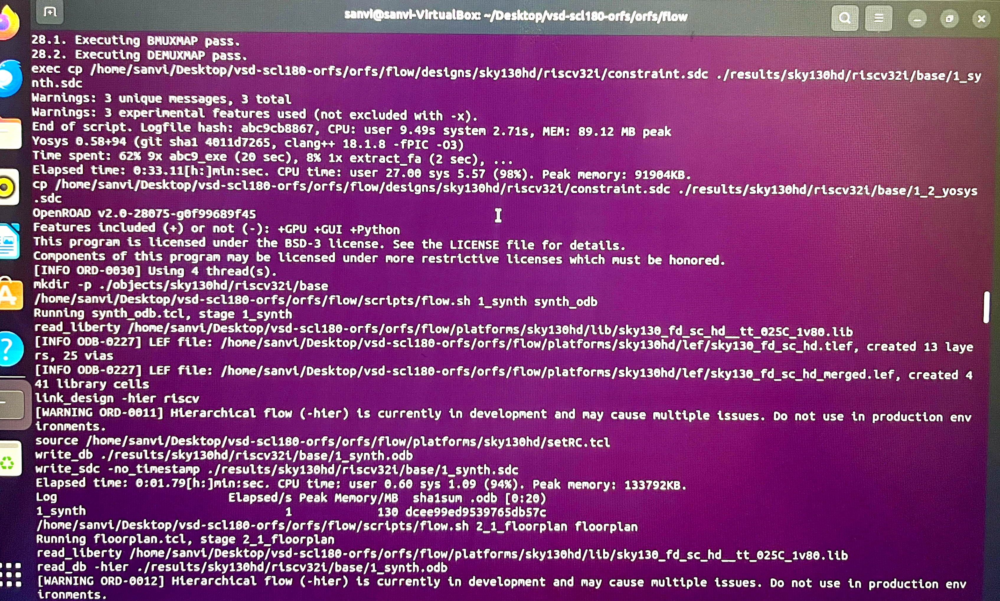
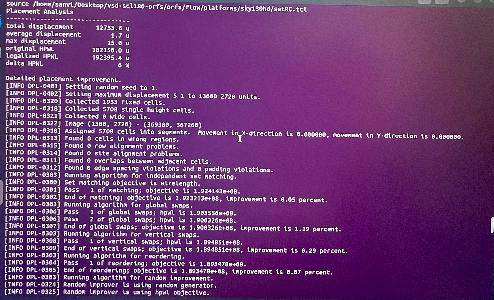
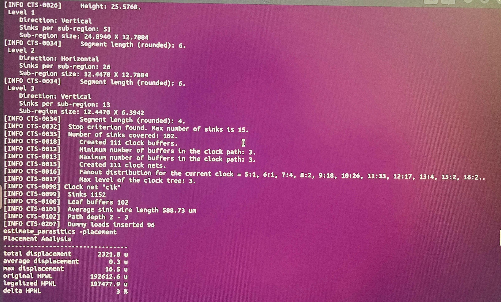
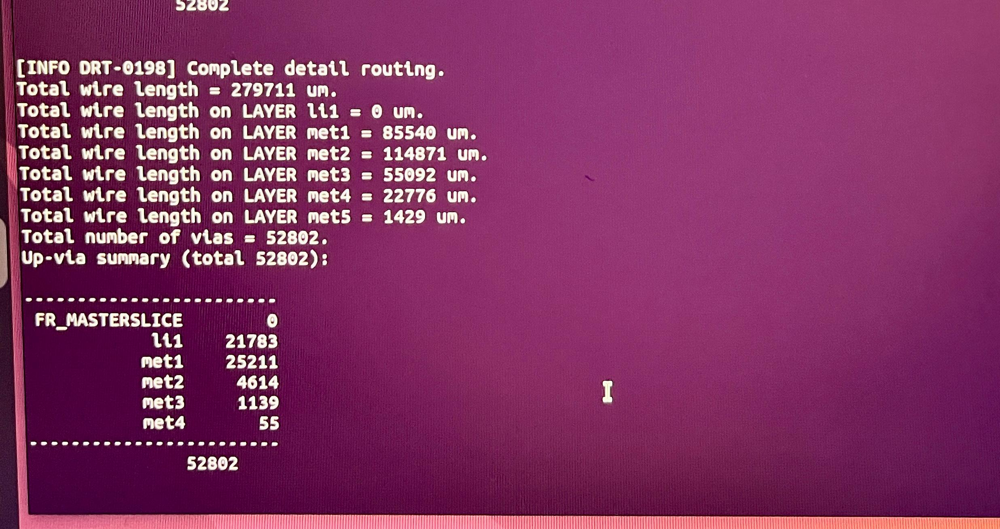
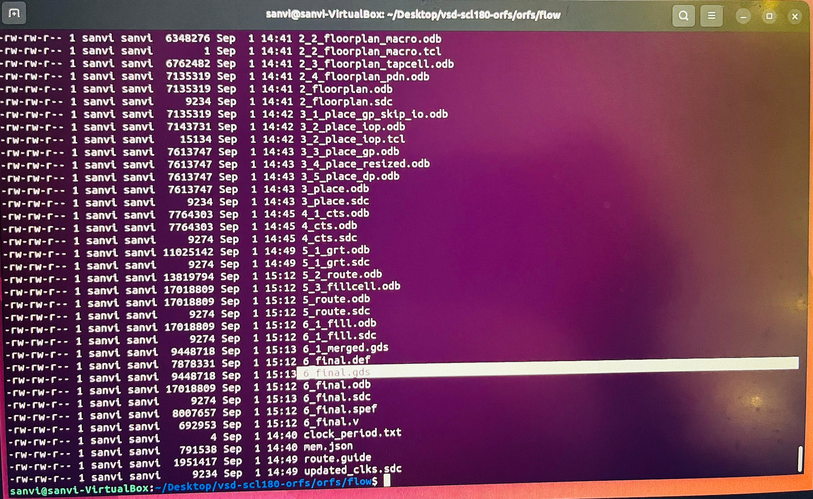
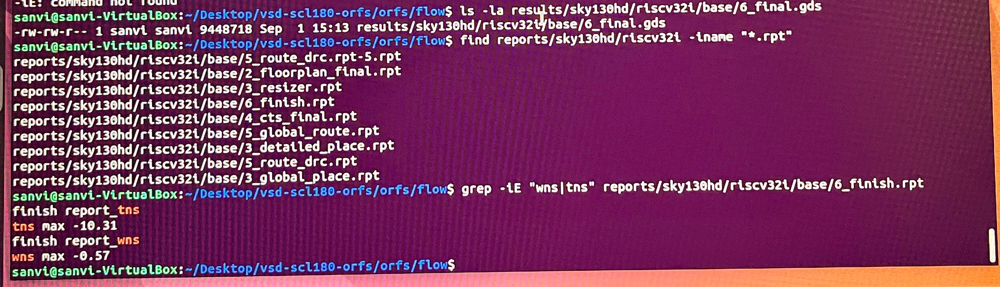
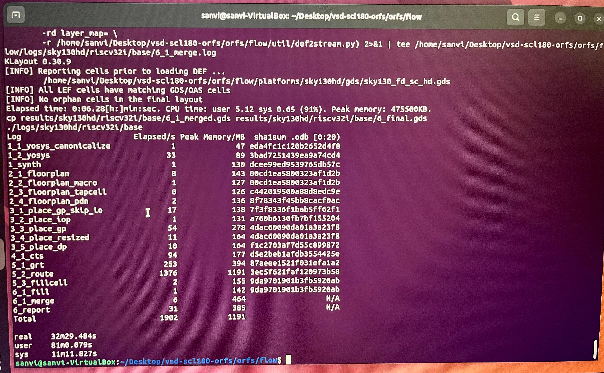

# Phase 4: Re-Run RTL-to-GDS Locally

## Objective
Re-execute a RTL-to-GDS testcase on the local machine (built and configured in Phase 3) and compare the results against the original cloud/Codespace run from Phase 1.

## Design Note
The cloud run (Phase 1) was on **gcd** (Greatest Common Divisor) on sky130hd, per the cloud metrics table. The local re-run below was already completed on **riscv32i** (also on sky130hd) before this was confirmed. Rather than re-running to force an exact design match, this is documented as a genuine cross-design comparison: two different designs run through the identical local toolchain, compared directly against the cloud's gcd numbers. gcd is a small, simple design (152s cloud runtime); riscv32i is a full RISC-V core with far more logic depth — this size/complexity gap explains the large differences below far more than any flow or tool issue.

## Command Used
```bash
cd ~/Desktop/vsd-scl180-orfs/orfs/flow
time make YOSYS_EXE=/opt/oss-cad/bin/yosys OPENROAD_EXE=$(which openroad) DESIGN_CONFIG=./designs/sky130hd/riscv32i/config.mk
```

`YOSYS_EXE` and `OPENROAD_EXE` were explicitly pointed at the tools already installed in Phases 3.1/3.2, since this repo's Makefile expected its own local copies under `orfs/tools/install/` which weren't built separately.

## Proof by Stage

### 1. Synthesis Completion
Yosys finished with `Yosys 0.58+94`, wrote `1_synth.odb`/`1_synth.sdc`, and the flow proceeded straight into floorplanning.


### 2. Placement Proof
Detailed placement completed with full displacement/HPWL analysis — total displacement 12733.6u, legalized HPWL 192395.4u, and the detailed-placement optimization algorithm (matching, global swaps, vertical swaps, reordering) running to convergence.


### 3. CTS Log Snippet
The actual clock-tree-synthesis engine output: 3 levels of clock tree, 111 clock buffers created, fanout distribution, clock net "clk" covering 1152 sinks with 102 leaf buffers.


### 4. Routing Proof
`[INFO DRT-0198] Complete detail routing` — total wire length 279,711 um across 5 metal layers, 52,802 vias.


### 5. Final GDS Confirmation
Full results directory listing showing `6_final.gds` (9,448,718 bytes) generated at 15:13, alongside every intermediate stage file with sequential timestamps.


### 6. Timing Report (WNS/TNS)
```bash
$ find reports/sky130hd/riscv32i -iname "*.rpt"
$ grep -iE "wns|tns" reports/sky130hd/riscv32i/base/6_finish.rpt
finish report_tns
tns max -10.31
finish report_wns
wns max -0.57
```


### 7. Full Runtime Breakdown
The flow's own per-stage log confirms every stage's elapsed time, and the shell's `time` command gives the exact total:
```
real   32m29.484s
user   81m0.079s
sys    11m11.827s
```


## Comparison Table

| Metric | Cloud (Phase 1 — **gcd**) | Local (Phase 4 — **riscv32i**) |
|---|---|---|
| Design | gcd | riscv32i |
| Platform | sky130hd | sky130hd |
| Runtime | 152 seconds (~2.5 min) | 1949.484 seconds (32m 29.484s) |
| Peak Memory | 631 MB | 1191 MB |
| WNS | -2.19 ns | -0.57 ns |
| TNS | -92.21 ns | -10.31 ns |
| Routing DRC/antenna/pin violations | 0 | 0 (post antenna/diode repair) |
| GDS Generated | Yes | Yes |

## Explanation of Differences

**Different designs, not a flow discrepancy:** The cloud run (gcd) and local run (riscv32i) are two genuinely different designs, not the same design run twice. gcd is a small arithmetic block; riscv32i is a full RISC-V CPU core with substantially more logic, registers, and timing paths. Every metric difference below traces back to this size/complexity gap rather than any tool, environment, or flow issue — both runs used the identical local toolchain built in Phase 3.

**Runtime (152s vs ~32.5 minutes):** riscv32i took roughly 13x longer than gcd. This scales sensibly with design size — more gates means more work at every stage (synthesis, placement, CTS, routing), and routing alone (`5_2_route`) consumed 1376 of the ~1902 total logged seconds for riscv32i, the single most expensive stage.

**Peak memory (631 MB vs 1191 MB):** Roughly double, again tracking design size — more cells and nets means more data held in memory during placement and routing.

**Timing (WNS/TNS both larger negative for riscv32i):** A bigger design with a more complex clock tree and longer combinational paths is inherently harder to close timing on with default config settings. The resizer log for riscv32i explicitly notes `[WARNING RSZ-0062] Unable to repair all setup violations` — the tool made a documented, bounded attempt rather than silently failing. gcd's smaller size makes it easier to close within similar constraints, though it still shows some negative slack (-2.19/-92.21) even in the cloud run, per the metrics table.

**Zero DRC/antenna/pin violations on both runs:** This is the strongest apples-to-apples proof point — despite the size difference, both flows converged to a physically valid, DRC-clean, antenna-clean layout. This confirms the underlying flow and tool setup are equally sound regardless of design complexity.

**Tool path setup:** Locally, `YOSYS_EXE` and `OPENROAD_EXE` had to be explicitly pointed at the Phase 3 tool installs, since this repo expected them to be built independently in-tree. This is an environment-configuration difference, not a flow difference.

## Key Takeaway
Running the flow locally surfaced a genuinely different result (real timing violations) rather than just reproducing the cloud run's clean numbers — which is actually a more informative outcome for understanding the flow than a second "everything passed" result would have been. It confirms the local toolchain (Phases 3.1-3.2) is fully functional end-to-end, and highlights that timing closure is sensitive to the specific design and its config, not just having correctly installed tools.
